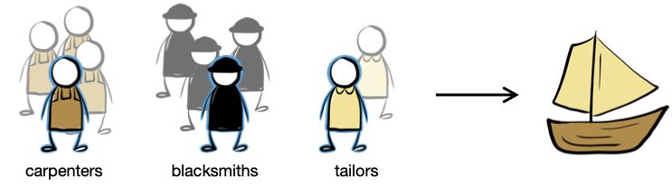
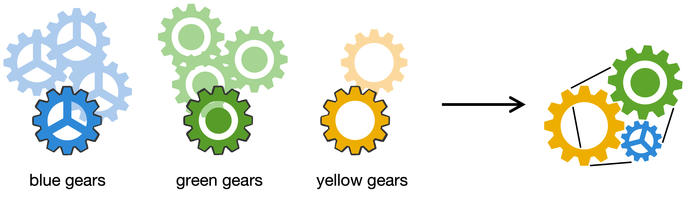
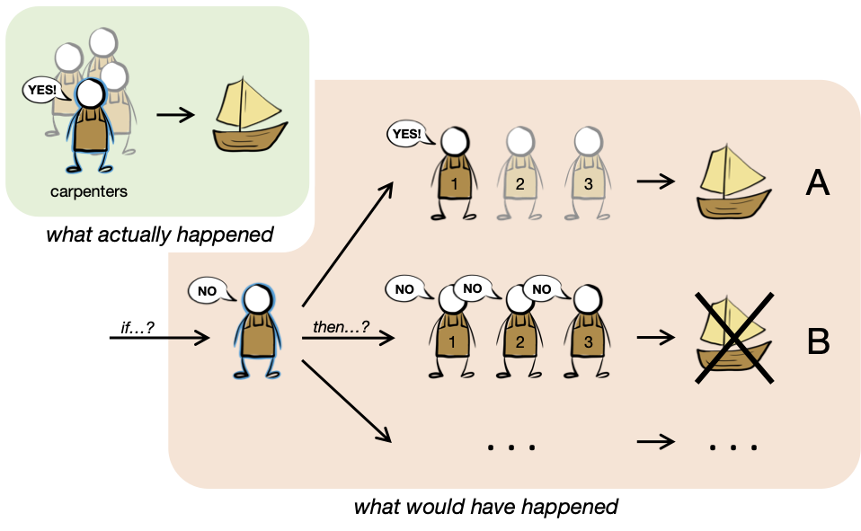

# If not me, then who? Responsibility and replacement

This repository contains the experiments, data, analyses, and figures for the paper "If not me, then who? Responsibility and replacement," by Sarah A. Wu and Tobias Gerstenberg (submitted).

__Contents__:
- [Introduction](#introduction)
- [Repository structure](#repository-struture)

## Introduction




<br clear="left" />
<br clear="right" />

How do people hold others responsible? Responsibility judgments are affected not only by what actually happened, but also by what could have happened if things had turned out differently. Here, we look at how replaceability -- the ease with which a person could have been replaced by someone else -- affects responsibility. We develop the counterfactual replacement model which runs simulations of alternative scenarios to determine the probability that the outcome would have been different if the person of interest had been replaced. The model predicts that a person is held more responsible when it would have been more difficult to replace them. To test the model's predictions, we design a paradigm that quantitatively varies replaceability by manipulating the number of replacements as well as the probability with which each replacement would have been available. Across three experiments featuring increasingly complex scenarios, we show that the model explains participants' responsibility judgments well in both social and physical settings, and better than alternative models that rely only on features of what actually happened.



A short video on an earlier version of this work can be found [here](https://www.youtube.com/watch?v=_jhCXqqtmdA) (from CogSci 2021).


## Repository structure

```
├── analysis
│   └── cache
├── data
│   ├── experiment1_agent
│   └── ...
├── docs
│   ├── experiment1_agent
│   └── ...
└── figures
    ├── experiment1
    └── ...
```

- `analysis/` contains all the code for analyzing data and generating figures, written in R
  (view a rendered file [here](https://cicl-stanford.github.io/responsibility_replacement/)).
- `data/` contains anonymized data from all experiments. For each experiment:
  - `trial_info.csv` is a description of the stimuli, also listed in the Appendices.
  - `trials.csv` contains the response data (i.e. responsibilty judgments).
  - `participants.csv` contains demographic information and post-experiment
    feedback/comments from participants.
  - `model-fits.RData` contains the best models fit to each individual participant.
- `docs/` contains all the experiment code. You can preview the experiments below:
    - Experiment 1 - [Agent condition](https://cicl-stanford.github.io/responsibility_replacement/experiment1_agent/),
      [Object condition](https://cicl-stanford.github.io/responsibility_replacement/experiment1_object/)
    - Experiment 2 - [Agent condition](https://cicl-stanford.github.io/responsibility_replacement/experiment2_agent/),
      [Object condition](https://cicl-stanford.github.io/responsibility_replacement/experiment2_object/)
    - Experiment 3 - [Agent condition](https://cicl-stanford.github.io/responsibility_replacement/experiment3_agent/),
      [Object condition](https://cicl-stanford.github.io/responsibility_replacement/experiment3_object/)
- `figures/` contains all the figures from the paper (generated using the script in `analysis/`).
